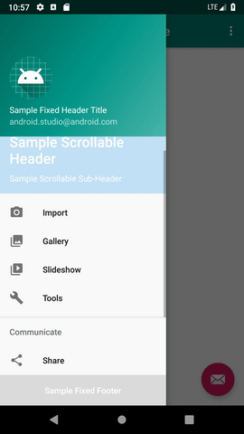

[](https://jitpack.io/#afshinpir/NavigationView)

# NavigationView

This Android library is designed for adding fixed and scrollable header
and footer support to Android's default NavigationView.

## Usage

### Download
 
This library is published on JitPack. You can add it to your project in
2 easy steps: 

1. **Add the JitPack repository to your build file**

Add the following to your root build.gradle at the end of repositories:
```gradle
allprojects {
    repositories {
        ...
        maven { url 'https://jitpack.io' }
    }
}
```

2. **Add dependency**

Add following dependency in your project:
```gradle
dependencies {
    implementation 'com.github.afshinpir:NavigationView:v1.0'
}
```

**Note**: NavigationView uses
[Android X](https://developer.android.com/jetpack/androidx/) artifacts.
So you need to migrate to it before using this library.

### Code

In order to use this NavigationView, it is enough to change your widget
from:

`android.support.design.widget.NavigationView` 

to:

`com.github.afshinpir.navigationview.NavigationView`

in you layout and code.

#### Widget
 
Rather than a simple `app:headerLayout`, this new widget provides 4
different types of header and footer:

| Attribute | Description | 
|---|---| 
| `app:fixedHeaderLayout` | Fixed header which stay on top of NavigationView all the time.|
| `app:scrollableHeaderLayout` | Scrollable header which scrolls along menu of NavigationView.|
| `app:scrollableFooterLayout` | Scrollable footer which scrolls along menu of NavigationView.|
| `app:fixedFooterLayout` | Fixed footer which stay on bottom of NavigationView all the time.|

You can add different types of header and footer at same time. By adding
all types of headers and footers, you can create layouts like this one:



 Other attributes of NavigationView are also supported. 
 
 ---
 This widget is created based on Android's default NavigationView.
